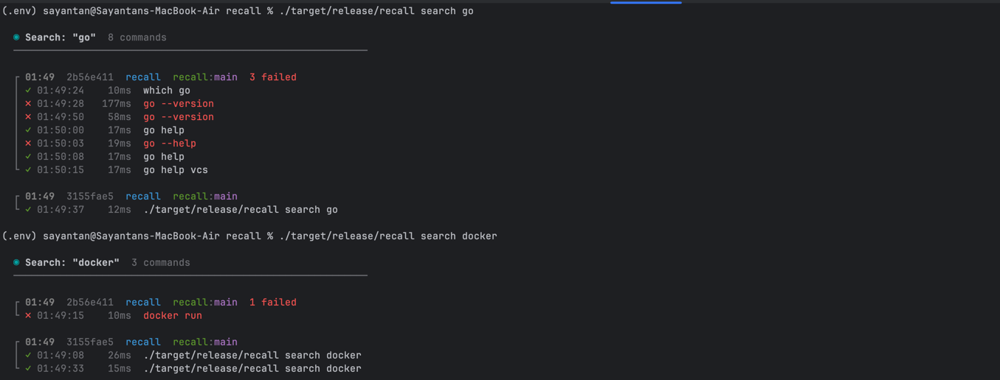
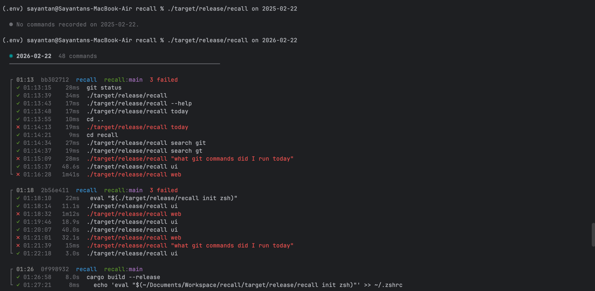
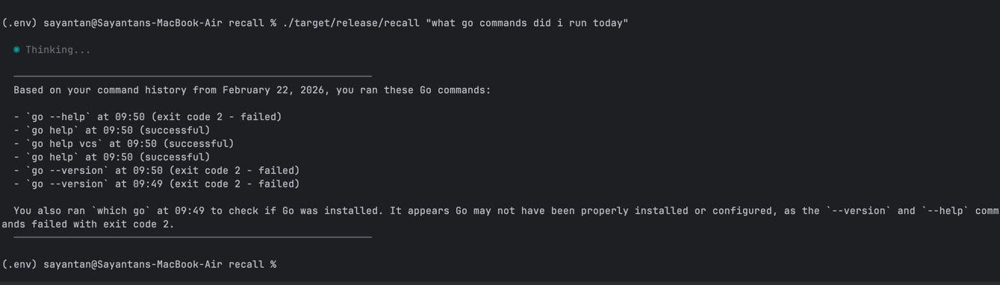
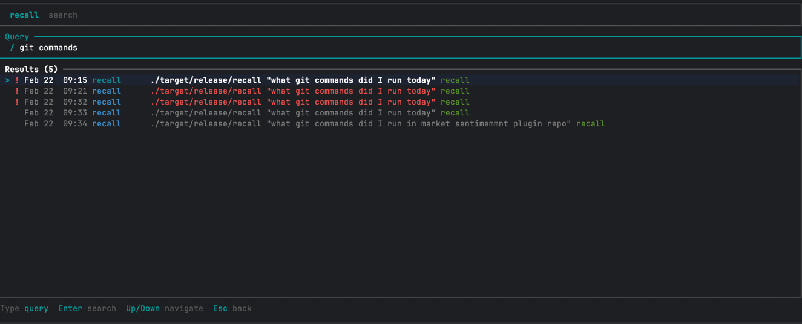
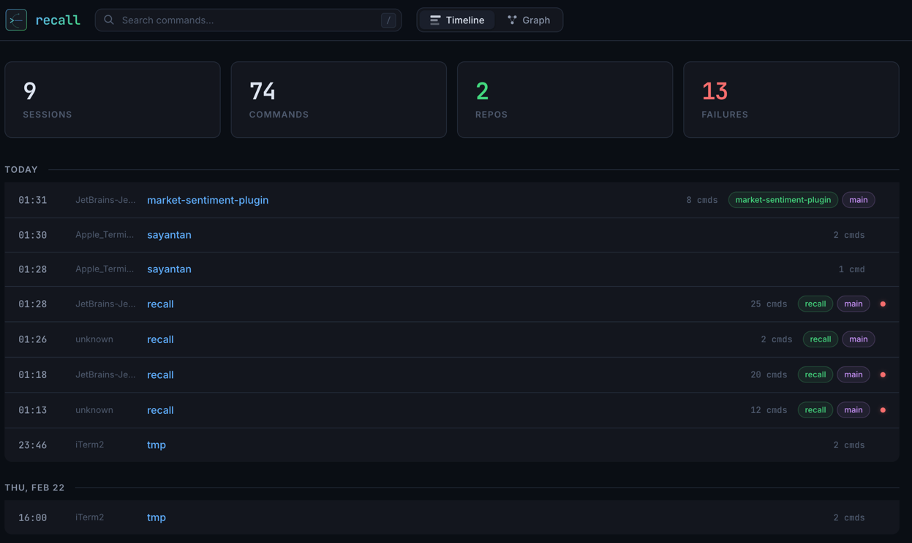
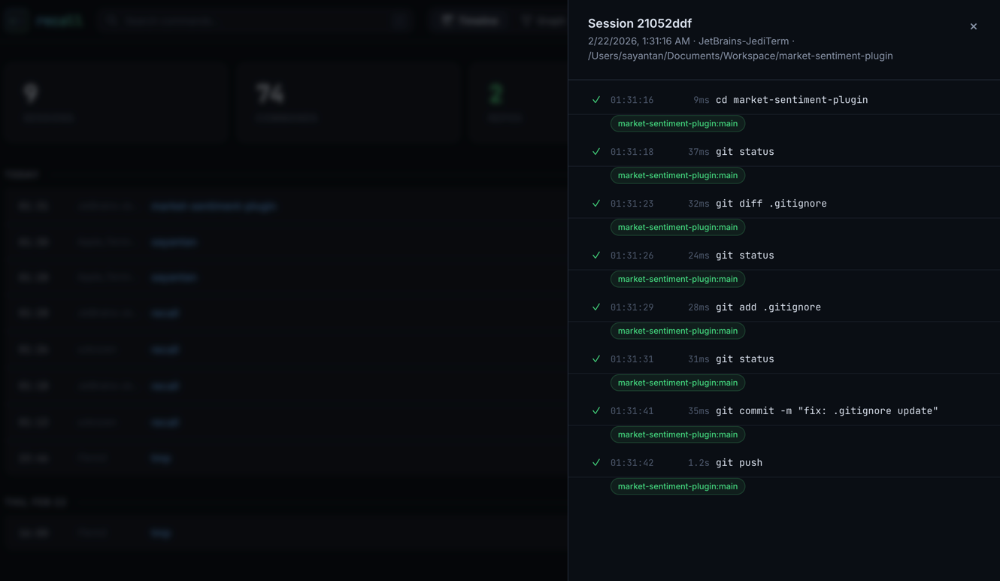

<p align="center">
  
</p>

<p align="center">
  A CLI, TUI, and web app that records your every terminal activity locally, so you can search, explore, and query it in natural language.
</p>

<p align="center">
  
  
  
  
  
</p>


A lightweight zsh hook captures every command you run across all terminal instances (iTerm, Terminal.app, IDE terminals etc) along with timestamps, exit codes, working directory, and git context, then stores it in a local SQLite database with full-text search. You query your history through the CLI, a terminal UI, a web-based graph view, or plain nlp questions powered by LLM.

> **Note:** Currently supports **zsh** only. Bash and fish support is planned.

## What you get

- **Full-text search** with filters for repo, directory, and exit code
- **Date browsing** for today or any specific day
- **Natural language Q&A** powered by LLM
- **Terminal UI** with timeline, session detail, and search views
- **Web dashboard** with stats, session timeline, and a force-directed repo graph
- **Session summaries** with auto-generated tags and intent classification
- **Privacy controls** with pause/resume and automatic secret filtering

### Search your history

```bash
recall search docker              # full-text search
recall search build --repo my-project   # filter by git repo
recall search test --failed       # only failed commands
```



### Browse by date

```bash
recall today                      # today's commands
recall on 2026-02-22              # specific date
```



### Ask questions (requires Anthropic API key or AWS Bedrock)

```bash
# Natural language queries
recall "what git commands did I run today"
recall "how did I fix that build error last week"
recall "which repos did I work on yesterday"
```



### Interactive TUI

```bash
recall ui
```

**TUI** stands for **Terminal User Interface**, a full-screen, interactive graphical interface that runs entirely inside your terminal.

`recall ui` takes over your terminal and gives you three views you can navigate between:

**Timeline view** Browse all sessions, see repos, failure indicators, and command counts:


**Search view** Press `/` to search across all commands:



Keyboard shortcuts:

| Key | Action |
|-----|--------|
| `↑` / `↓` | Move up / down |
| `Enter` | Drill into session detail |
| `/` | Open search |
| `Esc` | Go back to previous view |
| `q` | Quit |

### Web dashboard

```bash
recall web              # default port 3141
recall web --port 8080
```

Opens a full dashboard in your browser with:
- **Stats cards** total sessions, commands, repos, failures at a glance
- **Timeline view** sessions grouped by day, click to expand command details
- **Graph view** force-directed graph showing sessions linked by git repos and temporal proximity
- **Search** press `/` to search commands instantly





### LLM session summaries

```bash
# Summarize all unsummarized sessions
recall summarize
```

Generates a concise summary, tags, and intent classification for each session using Claude.

### Privacy controls

```bash
# Pause recording
recall pause

# Resume
recall resume
```

Sensitive commands (anything matching `export *KEY*`, `*SECRET*`, `*TOKEN*`, `*PASSWORD*`) are automatically filtered out and never stored.

## Getting started

### Prerequisites

Install Rust if you don't have it:

```bash
brew install rust
```

Both methods install `cargo` (the Rust build tool). You need `~/.cargo/bin` in your PATH so your shell can find `cargo` and any binaries you install with it (like `recall`).

If the installer didn't add it automatically, add this to your `~/.zshrc`:

```bash
export PATH="$HOME/.cargo/bin:$PATH"
```

Then reload your shell:

```bash
source ~/.zshrc
```

Verify it's working:

```bash
cargo --version
```

### Installation

```bash
# Build the binary
cargo build --release
```

Your binary is at `./target/release/recall`. Verify:

```bash
./target/release/recall --help
```

### Quick start

```bash
# 1. Build
cargo build --release

# 2. Test the hook in your current terminal
eval "$(./target/release/recall init zsh)"

# 3. Make it permanent, add to ~/.zshrc so it loads in every new terminal
echo 'eval "$(/absolute/path/to/recall/target/release/recall init zsh)"' >> ~/.zshrc
```

Replace `/absolute/path/to/recall` with your actual project path, e.g.:

```bash
echo 'eval "$(/Users/sayantan/Documents/Workspace/recall/target/release/recall init zsh)"' >> ~/.zshrc
```

New terminals will pick this up automatically. For your current terminal, either run `source ~/.zshrc` or the `eval` command directly.

This works across **all terminals** (iTerm, VS Code, Terminal.app, etc). The hook embeds the absolute path to the binary, so no global install is needed.

```bash
# Try it out
./target/release/recall today              # see today's commands
./target/release/recall search git         # full-text search
./target/release/recall ui                 # interactive TUI
./target/release/recall web                # web dashboard
```

### Uninstall

To stop recording, remove the `eval` line from your `~/.zshrc` and restart your terminal. To also delete all stored data:

```bash
rm -rf ~/.recall
```

## Configuration

Secrets live in `~/.recall/env` (never in the config file):

```bash
# ~/.recall/env
ANTHROPIC_API_KEY=sk-ant-...

# or for AWS Bedrock:
AWS_ACCESS_KEY_ID=AKIA...
AWS_SECRET_ACCESS_KEY=...
AWS_SESSION_TOKEN=...          
```

Settings live in `~/.recall/config.toml`:

### Anthropic API (default)

```toml
[privacy]
ignore_patterns = [
    "export *KEY*",
    "export *SECRET*",
    "export *TOKEN*",
    "export *PASSWORD*",
    "*AWS_SECRET*",
]

[llm]
provider = "anthropic"
model = "claude-sonnet-4-20250514"
```

### AWS Bedrock

```toml
[llm]
provider = "bedrock"
model = "us.anthropic.claude-sonnet-4-20250514-v1:0"
aws_region = "us-east-1"
```

recall loads `~/.recall/env` automatically before every operation. Environment variables already set in your shell take precedence over the env file. For Bedrock, you can also rely on credentials from `aws sso login` or an IAM role, just set the standard AWS env vars.

## Data storage

All data is stored locally at `~/.recall/`:

```
~/.recall/
├── recall.db        # SQLite database
├── config.toml      # Configuration (optional)
├── env              # Secrets, API keys, AWS credentials (optional)
└── .paused          # Pause marker file (when active)
```

### Debugging

Query the database directly with SQLite:

```bash
# View recent commands
sqlite3 ~/.recall/recall.db "SELECT timestamp, command_text FROM commands ORDER BY timestamp DESC LIMIT 10;"

# View all sessions
sqlite3 ~/.recall/recall.db "SELECT id, start_time, terminal_app, initial_dir FROM sessions ORDER BY start_time DESC LIMIT 10;"

# Check command count
sqlite3 ~/.recall/recall.db "SELECT COUNT(*) FROM commands;"

# Clear all data and start fresh
rm ~/.recall/recall.db
```

