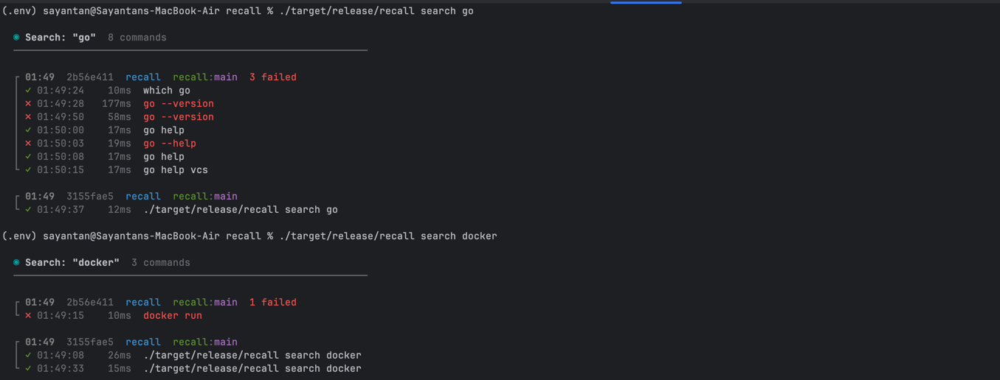
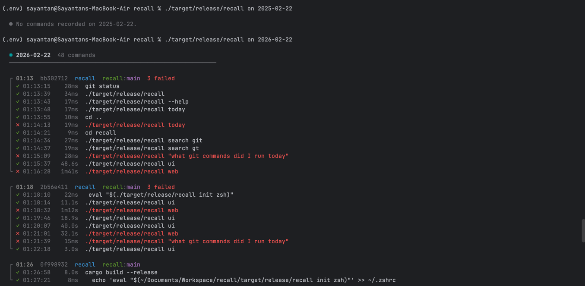
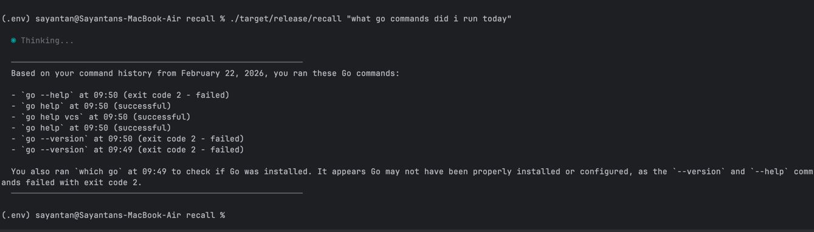
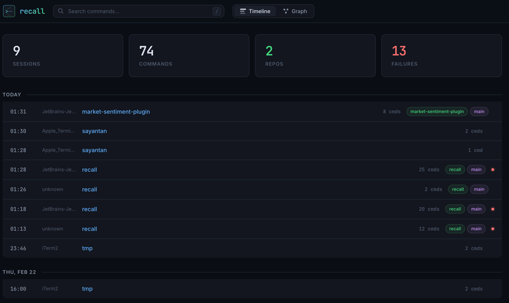
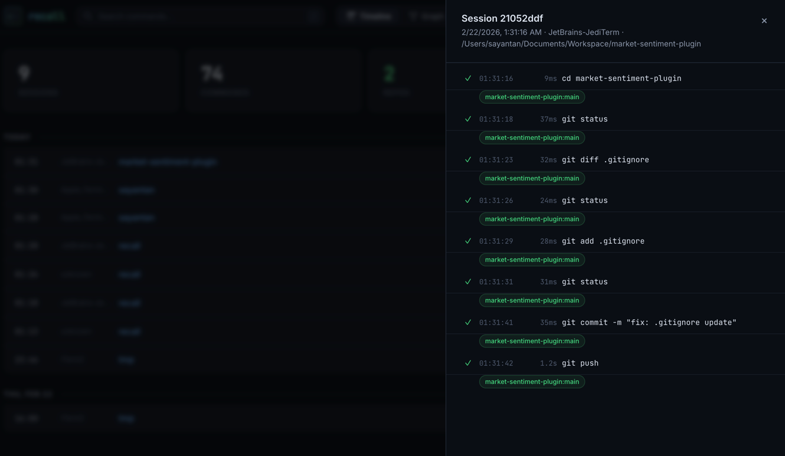

<p align="center">
  
</p>

<p align="center">
  Local memory for your whole terminal — the commands you ran and the AI coding sessions you had, in one searchable index.
</p>

<p align="center">
  
  
  
  
  
  
  
</p>

Your terminal work lives in two places now: the commands you type, and the conversations you have with an AI coding agent. recall indexes both, locally, in one searchable place.

## What it does

**Finds any conversation you've had with Claude Code or Codex, and drops you back into it.**
Every transcript those tools already keep on disk becomes full-text searchable. Find the session, press Enter, and recall hands the terminal straight to `claude --resume` or `codex resume`.

**Remembers every command you've run.** A zsh hook records what you ran, where, on which branch, how long it took, whether it failed, and what it printed.

**Searches both at once.** "how did I fix that build error" finds the command *and* the conversation about it — in one list, in one keystroke.

**Answers questions in plain English, with no API key.** If `claude` or `codex` is installed, recall drives it in headless mode and your existing subscription does the work.

**Stays entirely on your machine.** One local SQLite database. No account, no upload, no telemetry.

> Shell recording supports **zsh** only for now (bash and fish are planned). Agent session search works on any shell — it reads transcripts, not your terminal.

**[→ Jump to setup](#setup)**

## The TUI — the main way to use recall

```bash
recall        # bare `recall` opens the TUI
recall ui     # same thing, explicitly
```

One screen, one list. Agent sessions and shell sessions sit together, grouped by source, with the selected entry's details and full content rendered live beside it. There's no drill-in and no back button — you scan and read at the same time.

```
  recall   1332 agent sessions · 3956 commands indexed
  1 All 421  2 ● Claude Code 120  3 ● Codex 101  4 ● Shell 200     ⇧←/⇧→ switch

╭ Sessions ───────────────────────────────╮╭ Details ─────────────────────────────────────────────╮
│ ▾ CLAUDE CODE ──────────────────── 100  ││ Source:   Claude Code                                │
│ ▸ claude Fix flaky retry backoff  13m   ││ Session:  019ffe3a-4c21-70b2-be89-0cd560e54c9d       │
│   claude use the design plugin…   39m   ││ Project:  /Users/you/Workspace/recall                │
│ ▾ CODEX ────────────────────────── 101  ││ Date:     2026-08-19 23:31   13m                     │
│   codex  fix save_tailored_resume  6d   ││ Model:    claude-opus-4-6                            │
│ ▾ SHELL ────────────────────────── 200  ││ Search:   Full-text  212 messages  Enter to resume   │
│   shell  recall  AppliedIn      !  7m   ││ ─── Content ───                                      │
│                                         ││ ▸ the retry test flakes about 1 in 20 runs           │
│                                         ││ ▪ the backoff cap is 30s with no jitter, so…         │
╰──────────────────────────────── 1/300 ──╯╰──────────────────────────────────────────────────────╯
╭──────────────────────────────────────────────────────────────────────────────────────────────────╮
│ search> retry backoff│                                        [Full-text]  [Newest]              │
╰──────────────────────────────────────────────────────────────────────────────────────────────────╯
 Tab focus  ↑/↓ move  Enter resume  ⇧←→ source  ^G group  ^O sort  F1 help
```

Typing filters both corpora at once — full-text over agent conversations *and* over your shell commands — falling back to substring matching when full-text finds nothing, with matched terms underlined in the list and the transcript. Every source keeps its own query budget, so a thousand Claude sessions can't bury your Codex ones.

`Enter` shows the exact command it's about to run and asks yes/no. Confirm and recall tears down the TUI and hands the terminal to `claude --resume` / `codex resume`, in that session's own directory.

```
╭ Resume session ───────────────────────────────────────────────╮
│ Claude Code · 2026-08-19 23:31  (15m ago)                     │
│ Fix flaky retry backoff test                                  │
│                                                               │
│ $ claude --resume b278d659-554d-4dd2-b979-6b9efc06cba7        │
│   in /Users/you/Workspace/recall                              │
│                                                               │
│ Resume?    ▸ Yes   No                                         │
│                                                               │
│ y / Enter confirm    n / Esc cancel                           │
╰───────────────────────────────────────────────────────────────╯
```

Colours come from your terminal's own palette, and nothing is ever filled in. Body text is your default foreground; the selected row is *outlined* with thin box edges (`▏ … ▕`) rather than painted with a highlight block; matches are underlined. No background is ever set, no white is used, and the outline itself carries no colour — so it reads the same on a light or a dark theme.

**Picking a source** works two ways, and both are instant — results are already in memory.

*The tab bar*, for jumping straight there: `Shift+←` / `Shift+→` from anywhere including mid-query, or press `1`–`4` when the search box doesn't have focus. Every tab carries its own hit count for the current query, so you can see where the matches are before you switch.

*The group headers*, for working in place: they're selectable rows. Land on one and the right pane shows what's in that group — how many, how many projects, the time span, and the most recent titles. From there `Enter` drills in to show only that source, and `Space` folds the group shut so the sources underneath come into view.

```
│ ▸ CLAUDE CODE ─────────────────── 100 │   ● Claude Code
│ ▾ CODEX ───────────────────────── 100 │
│   codex  fix save_tailored_resume   6d│   Showing:  100 of these in the current view
│   codex  turn this into a skill     6d│   Projects: 5
│ ▾ SHELL ───────────────────────── 200 │   Span:     1d ago  →  18m ago
│   shell  recall  AppliedIn        ! 7m │
                                        │   Enter  show only Claude Code
                                        │   Space  fold this group
```

| Key | Action |
|-----|--------|
| *(type)* | Filter agent sessions and commands together |
| `Tab` / `Shift+Tab` | Cycle focus: search → list → content |
| `↑` / `↓`, `j` / `k` | Move the selection, or scroll the content pane |
| `g` / `G` | Jump to first / last |
| `Shift+←` / `Shift+→` | Switch source tab |
| `1` `2` `3` `4` | Jump straight to a tab (outside the search box) |
| `Enter` | On a session: resume it. On a group header: show only that source |
| `Space` | Fold or unfold the selected group |
| `r` | Resume the selected agent session |
| `Ctrl+G` | Group by source, or one flat newest-first list |
| `Ctrl+O` | Sort by newest or by best match |
| `Ctrl+U` | Clear the query |
| `Ctrl+R` | Rescan transcripts for sessions written since recall opened |
| `F1` / `?` | Key reference |
| `Esc` | Clear the query, then quit |

---

## Setup

recall has three parts, and they are independent. You can stop after any of them:

| | What it gives you | What it needs |
|---|---|---|
| **The binary** | Search and resume every Claude Code / Codex session you already have | Rust |
| **PATH** | Typing `recall` instead of a long path | One line in `~/.zshrc` |
| **The shell hook** | Recording the commands you run from now on | One more line in `~/.zshrc`, zsh only |

---

### 1. Install Rust

Skip if `cargo --version` already prints something.

```bash
curl https://sh.rustup.rs -sSf | sh      # or: brew install rust
```

### 2. Install recall

```bash
git clone https://github.com/sayantan94/recall.git
cd recall
cargo install --path .
```

This compiles recall and puts the binary at **`~/.cargo/bin/recall`**. It takes a couple of minutes the first time.

Verify:

```bash
~/.cargo/bin/recall --version
# recall 0.2.0
```

### 3. Put recall on your PATH

`cargo install` does *not* touch your `PATH`. If typing `recall` gives you `command not found`, this is why.

Check whether it's already there:

```bash
echo $PATH | tr ':' '\n' | grep '\.cargo/bin'
```

**No output?** Add it:

```bash
echo 'export PATH="$HOME/.cargo/bin:$PATH"' >> ~/.zshrc
source ~/.zshrc
```

Now this should work from anywhere:

```bash
recall --version
```

> Prefer not to change your `PATH`? Everything below works with the full path `~/.cargo/bin/recall` instead of `recall`.

### 4. Run `recall setup`

```bash
recall setup
```

This is the only command you need to run. It does four things:

1. **Indexes your agent sessions.** Every Claude Code and Codex conversation already on disk becomes searchable. This is retroactive — your whole history lights up on the first run, in a few seconds.
2. **Offers to add the shell hook to `~/.zshrc`.** It prints the exact line first and waits for a `y`. It never edits the file without asking. See step 5.
3. **Checks the ask engine.** Reports whether `claude` or `codex` is on your PATH, which is what makes plain-English questions work without an API key.
4. **Prints what to try next**, naming your most recent session back to you.

```
  ◉ Setting up recall
  ────────────────────────────────────────────────────────────
  ┌ Agent sessions   reading transcripts Claude Code & Codex already keep on disk
  │   claude    1232 sessions
  │   codex     101 sessions
  └ ✓ 1333 conversations indexed across 34 projects in 8.1s — searchable right now

  ┌ Shell recording  captures every command you run from now on
  │   recall never edits ~/.zshrc without asking.
  │   eval "$(/Users/you/.cargo/bin/recall init zsh)"
  │   This also wraps new shells in `script` so command output is captured.
  │   Append it to ~/.zshrc? [y/N] y
  └ ✓ added — every new terminal starts recording automatically

  ┌ Ask engine       lets you ask `recall "what broke yesterday"`
  └ ✓ claude and codex found on PATH — no API key needed
  ────────────────────────────────────────────────────────────
  Try it now:

    recall agents resume            reopen your latest session:
                                    Fix flaky retry backoff test  claude · 2h ago
    recall agents search "..."      search every conversation you've had
    recall                          browse and search everything in the TUI
    recall "what broke yesterday"   ask your history in plain English
```

Use `recall setup --yes` to accept the `~/.zshrc` edit without the prompt (useful in a dotfiles script).

### 5. The `~/.zshrc` line, in full

**This step is only for recording shell commands.** Searching and resuming agent sessions works without it — skip this whole step if that's all you want.

When you answer `y` in step 4, recall appends exactly this to the end of `~/.zshrc`:

```bash

# recall — records shell history
eval "$(/Users/you/.cargo/bin/recall init zsh)"
```

The path is absolute and points at whichever binary you ran `recall setup` with, so it keeps working regardless of your `PATH`.

**To add it by hand instead**, open `~/.zshrc` in an editor and paste this at the end:

```bash
eval "$(~/.cargo/bin/recall init zsh)"
```

Or append it in one command:

```bash
echo 'eval "$(~/.cargo/bin/recall init zsh)"' >> ~/.zshrc
```

(Use single quotes exactly as written — the `$(...)` must reach the file unexpanded, so that it runs each time a shell starts.)

**Either way, load it:**

```bash
source ~/.zshrc      # or just open a new terminal
```

**Verify it's recording.** Run any command, then ask recall about today:

```bash
echo hello
recall today
```

If `echo hello` appears in the output, the hook is live.

<details>
<summary>What the hook actually does</summary>

It registers zsh `preexec` and `precmd` hooks that record each command's text, exit code, duration, working directory and git branch. It also re-executes your shell under `script` so command *output* can be captured — which is what makes `recall search --failed` able to show you the error text, not just the command. That re-exec means a `/tmp` typescript file per shell, and `exit` may take two presses.

Don't want output capture? Use `recall pause` to stop recording at any time, or leave the hook out entirely and use recall purely for agent sessions.

</details>

### 6. Start recall

```bash
recall
```

Bare `recall` opens the TUI — that's the main way to use it. It indexes anything new before it opens, so a session you started a minute ago is already there.

```bash
recall                       # the TUI
recall agents resume         # jump straight back into your latest session
recall agents search "retry" # one-shot search, no TUI
recall today                 # today's commands
recall "what broke today"    # plain-English question
```

### Re-running setup

`recall setup` is safe to re-run any time and doubles as a status screen. It's also how you clean up after an upgrade:

- **An older install still wired into `~/.zshrc`** — a hook line or an `alias recall=` pointing at a previous binary — is detected and offered up for repointing. Your previous file is saved as `~/.zshrc.recall-backup` first.
- **An index built by an older version** is rebuilt automatically, since parsing rules change between releases.

If you decline the edit, setup prints the exact lines to change, whether `PATH` needs fixing, how to reload, and how to start recall meanwhile.

### Troubleshooting

**`zsh: command not found: recall`** — `~/.cargo/bin` isn't on your `PATH`. Do step 3, or use the full path `~/.cargo/bin/recall`.

**Commands aren't being recorded** — the hook isn't loaded. Check with `grep recall ~/.zshrc`; if the line is there, run `source ~/.zshrc` or open a new terminal. Note that only commands run *after* the hook loads are recorded.

**A new agent session doesn't appear** — press `Ctrl+R` in the TUI to rescan, or run `recall agents index`.

**Two different recalls installed** — run `recall setup`; it detects a stale binary still wired into `~/.zshrc` and offers to repoint it.

### Building without installing

```bash
cargo build --release
./target/release/recall setup
```

The hook line embeds the absolute path of whichever binary ran `setup`, so this works too — just don't also `cargo install`, or you'll have two copies.

### Uninstall

```bash
# 1. stop recording: delete the `eval "$(... recall init zsh)"` line from ~/.zshrc
# 2. remove the binary
cargo uninstall recall
# 3. delete all stored data (optional)
rm -rf ~/.recall
```

Your Claude Code and Codex transcripts are never modified or copied — removing recall leaves them exactly as they were.

---

## The CLI

The TUI is the product; these commands exist for scripting and piping.

### Find and resume agent sessions

recall reads the transcripts Claude Code and Codex already keep on disk — nothing is copied anywhere else, and no API calls are involved.

```bash
recall agents search "retry backoff"   # find the conversation
recall agents resume 019ffe3f          # reopen it in Claude Code or Codex
recall agents resume                   # or just reopen the most recent one
```

Sessions you've named in Claude Code (`claude -n "<name>"`, or renaming one in the UI) show that name, marked with a `★`, in the list, the details pane and the CLI. Where you haven't named one, recall uses the title Claude Code generated for itself, and only falls back to the opening prompt when there is neither. Codex records no session name today; if it starts to, recall will pick it up.

The index builds itself. `recall setup` seeds it, opening the TUI rescans, and every CLI search reconciles before answering — so a session you started a minute ago is already there. `Ctrl+R` inside the TUI rescans without leaving, and `recall agents index` exists if you want to run it by hand.

Rescanning is cheap because it compares size and mtime first and only re-reads what changed. On ~1,300 indexed transcripts: **0.17s** when nothing changed, **0.22s** to pick up 20 edited sessions, **0.31s** to re-read a single 68 MB transcript from scratch.

Indexing is incremental and reconciled: unchanged transcripts are skipped, edited ones are re-read, and sessions you deleted at the source drop out of the index. A first run over ~1,300 sessions takes about eight seconds; every run after that takes about a third of one — which is why recall refreshes the index automatically before every search rather than making you remember to.

| Source | Transcripts read from | Resumed with |
|--------|----------------------|--------------|
| **Claude Code** | `~/.claude/projects/*/‹session›.jsonl` | `claude --resume ‹id›` |
| **Codex** | `~/.codex/sessions/YYYY/MM/DD/*.jsonl` | `codex resume ‹id›` |

More ways to slice it:

```bash
recall agents list --source codex        # newest first, one source
recall agents search build --project api # only sessions from a project path
recall agents search "sessi" --fuzzy     # substring match instead of whole words
recall agents show 019ffe3f              # print the whole transcript
recall agents resume                     # reopen the most recent session
recall agents resume 019ffe3f --print    # print the command instead of running it
recall agents stats                      # what's currently indexed
```

Sessions are matched by full session id, by source-qualified id (`claude:019ff…`), or by any unique prefix. Search is BM25-ranked over conversation chunks and collapses to one hit per session, showing the excerpt that matched. If full-text search comes up empty, recall retries as a substring match automatically.

You rarely need to run `recall agents index` by hand: `search` and `list` reconcile the index first and say so on stderr when something changed. Pass `--no-index` to skip that.

### Search your history

```bash
recall search docker              # full-text search
recall search build --repo my-project   # filter by git repo
recall search test --failed       # only failed commands
```



### Browse by date

```bash
recall today                      # today's commands
recall on 2026-02-22              # specific date
```



### Ask questions (no API key needed)

```bash
# Natural language queries
recall "what git commands did I run today"
recall "how did I fix that build error last week"
recall "which repos did I work on yesterday"
```

If `claude` or `codex` is installed and logged in, recall drives it in headless mode and your existing subscription does the work — no API key, no configuration. Claude Code is tried first, then Codex; if neither is installed and no API key is set, only this feature is unavailable and recall says so.

Those runs are isolated: recall passes `claude --no-session-persistence` / `codex exec --ephemeral`, so asking recall a question never leaves a stray session in your own Claude Code or Codex history. (Any that were recorded before this landed get dropped from the index automatically.)

An `ANTHROPIC_API_KEY` or AWS Bedrock setup still works, and takes over if you set `llm.provider` explicitly.




## More

### Web dashboard

```bash
recall web              # default port 3141
recall web --port 8080
```

Opens a full dashboard in your browser with:
- **Stats cards** total sessions, commands, repos, failures at a glance
- **Timeline view** sessions grouped by day, click to expand command details
- **Graph view** force-directed graph showing repos and tools as a constellation
- **Search** press `/` to search commands instantly

<p align="center">
  
</p>





### LLM session summaries

```bash
# Summarize all unsummarized sessions
recall summarize
```

Generates a concise summary, tags, and intent classification for each session using Claude.

### Privacy controls

```bash
# Pause recording
recall pause

# Resume
recall resume
```

Sensitive commands (anything matching `export *KEY*`, `*SECRET*`, `*TOKEN*`, `*PASSWORD*`) are automatically filtered out and never stored.

## Configuration

Secrets live in `~/.recall/env` (never in the config file):

```bash
# ~/.recall/env
ANTHROPIC_API_KEY=sk-ant-...

# or for AWS Bedrock:
AWS_ACCESS_KEY_ID=AKIA...
AWS_SECRET_ACCESS_KEY=...
AWS_SESSION_TOKEN=...          
```

Settings live in `~/.recall/config.toml`:

By default (`provider = "auto"`) recall needs none of this — it uses an installed `claude` or `codex` CLI. Configure a provider only if you want to override that.

### Installed CLI

```toml
[llm]
provider = "cli"
cli = "claude"        # or "codex"; omit to auto-detect
cli_model = "haiku"   # optional; omit to let the tool choose
```

### Anthropic API

```toml
[privacy]
ignore_patterns = [
    "export *KEY*",
    "export *SECRET*",
    "export *TOKEN*",
    "export *PASSWORD*",
    "*AWS_SECRET*",
]

[llm]
provider = "anthropic"
model = "claude-sonnet-4-20250514"
```

### AWS Bedrock

```toml
[llm]
provider = "bedrock"
model = "us.anthropic.claude-sonnet-4-20250514-v1:0"
aws_region = "us-east-1"
```

recall loads `~/.recall/env` automatically before every operation. Environment variables already set in your shell take precedence over the env file. For Bedrock, you can also rely on credentials from `aws sso login` or an IAM role, just set the standard AWS env vars.

## Data storage

All data is stored locally at `~/.recall/`. Agent transcripts are read in place from `~/.claude` and `~/.codex` and never copied — recall stores only the searchable index derived from them.

```
~/.recall/
├── recall.db        # SQLite database
├── config.toml      # Configuration (optional)
├── env              # Secrets, API keys, AWS credentials (optional)
└── .paused          # Pause marker file (when active)
```

### Debugging

Query the database directly with SQLite:

```bash
# View recent commands
sqlite3 ~/.recall/recall.db "SELECT timestamp, command_text FROM commands ORDER BY timestamp DESC LIMIT 10;"

# View all sessions
sqlite3 ~/.recall/recall.db "SELECT id, start_time, terminal_app, initial_dir FROM sessions ORDER BY start_time DESC LIMIT 10;"

# Check command count
sqlite3 ~/.recall/recall.db "SELECT COUNT(*) FROM commands;"

# View indexed agent sessions
sqlite3 ~/.recall/recall.db "SELECT source, session_id, title FROM ai_sessions ORDER BY last_activity DESC LIMIT 10;"

# Count indexed agent sessions per source
sqlite3 ~/.recall/recall.db "SELECT source, COUNT(*) FROM ai_sessions GROUP BY source;"

# Clear all data and start fresh
rm ~/.recall/recall.db
```

## License

[MIT](LICENSE) © Sayantan Bhowmik
